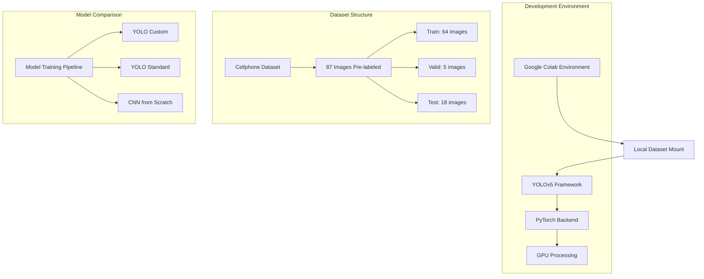
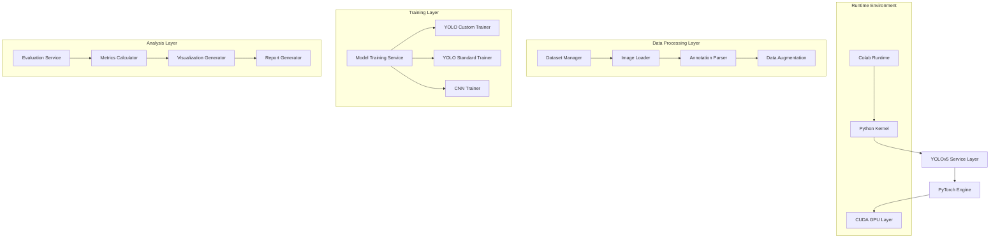
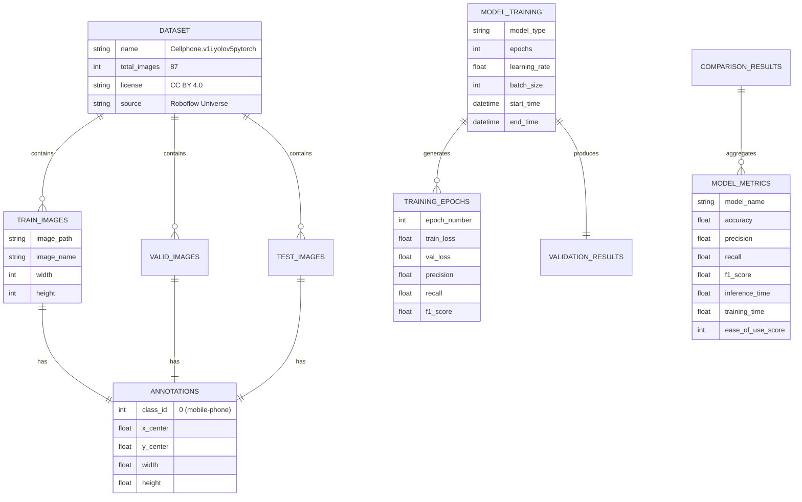

# Documento de Arquitetura Técnica - Sistema de Visão Computacional FarmTech Solutions

**📥 Dataset:** Disponível no Google Drive: https://drive.google.com/drive/folders/1eNyD5c1piv-9Vpsxfp5xWPR-IlBxh7C0?usp=sharing

## 1. Architecture design



## 2. Technology Description

**Frontend/Interface:**

* Google Colab Notebook interface

* Jupyter widgets para interatividade

* matplotlib + plotly para visualizações

* OpenCV para processamento de imagens

**Backend/Processing:**

* YOLOv5 (Ultralytics implementation)

* PyTorch 1.12+ como framework base

* torchvision para transformações de imagem

* CUDA para aceleração GPU

**Dataset Management:**

* **Google Drive:** https://drive.google.com/drive/folders/1eNyD5c1piv-9Vpsxfp5xWPR-IlBxh7C0?usp=sharing
* **Dataset local:** `/Volumes/SSDExterno/rede_neural/Cellphone.v1i.yolov5pytorch/`
* **Colab path:** `/content/drive/MyDrive/FarmTech_Dataset/Cellphone.v1i.yolov5pytorch/`
* **Formato:** YOLO annotation format (.txt files)
* **Classe única:** `mobile-phone`

* Licença: CC BY 4.0 (Roboflow Universe)

## 3. Route definitions

| Route/Section     | Purpose                                                                |
| ----------------- | ---------------------------------------------------------------------- |
| /setup            | Configuração do ambiente, instalação de dependências, mount do dataset |
| /data-analysis    | Análise exploratória do dataset de celulares, visualização de amostras |
| /yolo-custom      | Treinamento do modelo YOLO customizado com diferentes épocas           |
| /yolo-standard    | Implementação e teste do YOLO padrão para comparação                   |
| /cnn-scratch      | Desenvolvimento de CNN do zero para classificação                      |
| /model-comparison | Comparação quantitativa entre os três modelos                          |
| /results-viz      | Visualização de resultados e detecções em imagens de teste             |
| /security-demo    | Demonstração prática para cenários de segurança patrimonial            |

## 4. API definitions

### 4.1 Core Functions

**Dataset Loading and Analysis**

```python
def load_cellphone_dataset(dataset_path: str) -> Dict[str, Any]:
    """
    Carrega o dataset de celulares e retorna estatísticas
    """
    return {
        "train_images": List[str],
        "valid_images": List[str], 
        "test_images": List[str],
        "class_distribution": Dict[str, int],
        "dataset_stats": Dict[str, Any]
    }
```

**YOLO Custom Training**

```python
def train_yolo_custom(
    data_yaml: str,
    epochs: int,
    img_size: int = 640,
    batch_size: int = 16
) -> Dict[str, Any]:
    """
    Treina modelo YOLO customizado
    """
    return {
        "model_path": str,
        "training_metrics": Dict[str, List[float]],
        "validation_metrics": Dict[str, float],
        "training_time": float
    }
```

**Model Comparison**

```python
def compare_models(
    yolo_custom_results: Dict,
    yolo_standard_results: Dict,
    cnn_results: Dict
) -> Dict[str, Any]:
    """
    Compara performance entre os três modelos
    """
    return {
        "accuracy_comparison": Dict[str, float],
        "training_time_comparison": Dict[str, float],
        "inference_time_comparison": Dict[str, float],
        "ease_of_use_score": Dict[str, int]
    }
```

**Security Detection Demo**

```python
def security_detection_demo(
    model_path: str,
    test_images: List[str],
    confidence_threshold: float = 0.5
) -> Dict[str, Any]:
    """
    Demonstra detecção de celulares para segurança
    """
    return {
        "detections": List[Dict[str, Any]],
        "security_alerts": List[str],
        "processed_images": List[str]
    }
```

## 5. Server architecture diagram



## 6. Data model

### 6.1 Data model definition



### 6.2 Data Definition Language

**Dataset Structure (Already Existing)**

```yaml
# data.yaml (existing file)
train: ../train/images
val: ../valid/images  
test: ../test/images

nc: 1
names: ['mobile-phone']

roboflow:
  workspace: lolli
  project: cellphone-q8trb
  version: 1
  license: CC BY 4.0
  url: https://universe.roboflow.com/lolli/cellphone-q8trb/dataset/1
```

**Training Results Storage**

```python
# Estrutura de dados para armazenar resultados de treinamento
training_results = {
    "yolo_custom_30_epochs": {
        "model_path": "runs/train/exp/weights/best.pt",
        "training_time": 1200.5,  # segundos
        "final_metrics": {
            "precision": 0.85,
            "recall": 0.82,
            "f1_score": 0.835,
            "map_50": 0.78
        },
        "epoch_history": [
            {"epoch": 1, "train_loss": 0.8, "val_loss": 0.75},
            # ... mais épocas
        ]
    },
    "yolo_custom_60_epochs": {
        # estrutura similar
    },
    "yolo_standard": {
        # estrutura similar
    },
    "cnn_from_scratch": {
        # estrutura similar
    }
}
```

**Security Detection Results**

```python
# Estrutura para resultados de detecção de segurança
security_detection_results = {
    "test_image_1.jpg": {
        "detections": [
            {
                "class": "mobile-phone",
                "confidence": 0.92,
                "bbox": [x1, y1, x2, y2],
                "security_alert": True
            }
        ],
        "processing_time": 0.045  # segundos
    }
    # ... mais imagens
}
```

**Model Comparison Matrix**

```python
# Matriz de comparação entre modelos
comparison_matrix = {
    "metrics": ["Facilidade de Uso", "Precisão", "Tempo Treinamento", "Tempo Inferência"],
    "models": {
        "YOLO Custom": [5, 4, 3, 5],      # scores 1-5
        "YOLO Standard": [4, 3, 5, 4],
        "CNN from Scratch": [2, 3, 2, 3]
    },
    "detailed_results": {
        "precision": {"YOLO Custom": 0.85, "YOLO Standard": 0.78, "CNN": 0.72},
        "training_time": {"YOLO Custom": 1200, "YOLO Standard": 300, "CNN": 2400},
        "inference_time": {"YOLO Custom": 0.045, "YOLO Standard": 0.052, "CNN": 0.089}
    }
}
```

