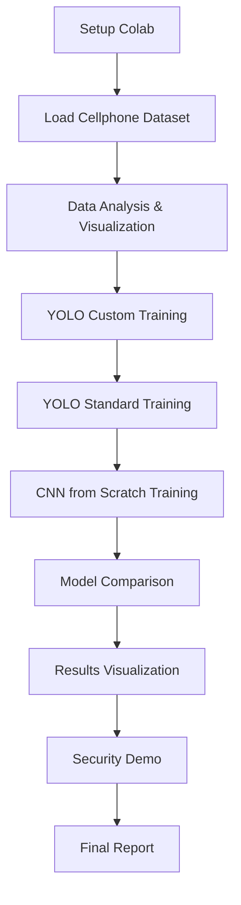

# Documento de Requisitos do Produto - Sistema de Visão Computacional FarmTech Solutions

## 1. Product Overview

Sistema demonstrativo de visão computacional usando YOLO para detecção de celulares em ambientes de segurança patrimonial. O projeto utiliza um dataset real de 87 imagens já rotuladas para demonstrar as capacidades de IA da FarmTech Solutions na área de controle de acesso e monitoramento de dispositivos móveis.

**📥 Dataset:** Disponível no Google Drive: https://drive.google.com/drive/folders/1eNyD5c1piv-9Vpsxfp5xWPR-IlBxh7C0?usp=sharing

- **Problema a resolver**: Necessidade de detectar automaticamente celulares em ambientes restritos (salas seguras, áreas de produção, locais confidenciais)
- **Usuários**: Clientes da FarmTech Solutions interessados em soluções de segurança patrimonial e controle de acesso
- **Valor do produto**: Demonstração prática das capacidades de visão computacional para aplicações de segurança

## 2. Core Features

### 2.1 User Roles

| Role | Registration Method | Core Permissions |
|------|---------------------|------------------|
| Desenvolvedor FarmTech | Acesso direto ao Colab | Pode executar treinamentos, visualizar resultados, comparar modelos |
| Cliente Demonstração | Visualização dos resultados | Pode ver outputs, métricas de performance, imagens processadas |

### 2.2 Feature Module

Nosso sistema de visão computacional consiste nas seguintes funcionalidades principais:

1. **Preparação do Dataset**: carregamento do dataset de celulares, análise da distribuição, visualização de amostras
2. **Treinamento YOLO Customizado**: configuração de hiperparâmetros, treinamento com diferentes épocas (30 vs 60), validação
3. **Comparação de Modelos**: YOLO customizado vs YOLO padrão vs CNN do zero
4. **Análise de Resultados**: métricas de performance, visualização de detecções, relatório comparativo
5. **Demonstração Prática**: inferência em tempo real, casos de uso de segurança

### 2.3 Page Details

| Page Name | Module Name | Feature description |
|-----------|-------------|---------------------|
| Setup e Configuração | Ambiente de desenvolvimento | Instalar dependências YOLOv5, configurar GPU, conectar Google Drive |
| Dataset Analysis | Análise do dataset de celulares | Carregar 87 imagens (64 train, 5 valid, 18 test), visualizar distribuição, mostrar exemplos rotulados |
| YOLO Training | Treinamento customizado | Configurar modelo YOLOv5, treinar com 30 épocas, treinar com 60 épocas, comparar resultados |
| Model Comparison | Comparação de abordagens | Implementar YOLO padrão, treinar CNN do zero, avaliar métricas (precisão, recall, F1-score, tempo) |
| Results Visualization | Visualização de resultados | Mostrar detecções em imagens teste, gráficos de loss/accuracy, matriz de confusão |
| Security Demo | Demonstração prática | Simular cenários de segurança, detecção em tempo real, casos de uso patrimonial |

## 3. Core Process

**Fluxo Principal do Desenvolvedor:**
1. Configurar ambiente Colab e conectar ao dataset local
2. Analisar o dataset de celulares (87 imagens já rotuladas)
3. Treinar modelo YOLO customizado com diferentes configurações de épocas
4. Implementar e treinar modelos alternativos (YOLO padrão, CNN)
5. Comparar performance entre os três modelos
6. Gerar visualizações e relatório de resultados
7. Demonstrar aplicação prática em cenários de segurança

**Fluxo de Demonstração para Cliente:**
1. Apresentar o problema de segurança patrimonial
2. Mostrar o dataset e processo de rotulação
3. Demonstrar treinamento e validação dos modelos
4. Comparar resultados entre diferentes abordagens
5. Apresentar casos de uso práticos em segurança

## 4. User Interface Design

### 4.1 Design Style

- **Cores primárias**: Azul profissional (#1f4e79), Verde FarmTech (#2d5a27)
- **Cores secundárias**: Cinza claro (#f8f9fa), Laranja destaque (#ff6b35)
- **Estilo de botões**: Arredondados com sombra sutil
- **Fontes**: Roboto para títulos, Open Sans para texto
- **Layout**: Baseado em células Jupyter com visualizações profissionais
- **Ícones**: Material Design para consistência

### 4.2 Page Design Overview

| Page Name | Module Name | UI Elements |
|-----------|-------------|-------------|
| Setup e Configuração | Ambiente | Células de código com outputs coloridos, progress bars para instalação |
| Dataset Analysis | Visualização de dados | Grid de imagens 3x3, gráficos de distribuição, estatísticas em cards |
| YOLO Training | Interface de treinamento | Progress bars de época, gráficos de loss em tempo real, métricas em tabelas |
| Model Comparison | Dashboard comparativo | Tabela de métricas, gráficos de barras comparativos, heatmaps de performance |
| Results Visualization | Galeria de resultados | Imagens com bounding boxes, gráficos de confiança, matriz de confusão |
| Security Demo | Demonstração prática | Simulação de câmeras de segurança, alertas visuais, cenários de uso |

### 4.3 Responsiveness

O projeto é otimizado para visualização em notebooks Jupyter no Google Colab, com foco em:
- Visualizações adaptáveis para diferentes tamanhos de tela
- Gráficos interativos usando plotly
- Layout responsivo para apresentações
- Compatibilidade com dispositivos móveis para demonstrações